# DSO101 Assignment 1: CI/CD with Docker, Render & GitHub

**Student:** Tshewang Lhamo  
**Student ID:** 02250377  
**Course:** DSO101 - Continuous Integration and Continuous Deployment  
**Program:** Bachelor's of Engineering in Software Engineering  

**GitHub Repository:** https://github.com/twglhamo/TshewangLhamo_02250377_DSO101_A1.git

---

## TABLE OF CONTENTS

1. [Project Overview](#project-overview)
2. [Tech Stack](#tech-stack)
3. [Step 0: Local Development Setup](#step-0-local-development-setup)
4. [Part A: Docker Hub Deployment](#part-a-docker-hub-deployment)
5. [Part B: Automated Git-Based Deployment](#part-b-automated-git-based-deployment)
6. [Testing & Verification](#testing--verification)
7. [Conclusion](#conclusion)

---

## PROJECT OVERVIEW

This assignment demonstrates a complete CI/CD pipeline for a full-stack To-Do application:

- **Frontend:** React + Vite (modern JavaScript framework)
- **Backend:** Express.js + Node.js (REST API)
- **Database:** PostgreSQL (persistent data storage)
- **Containerization:** Docker (consistent environments)
- **Deployment:** Render.com (cloud platform)
- **CI/CD Automation:** Git-based automatic deployment via Blueprint

### Key Features Implemented

- ✅ Full CRUD operations for tasks
- ✅ Real-time frontend-backend communication
- ✅ Containerized microservices
- ✅ Environment-specific configuration (.env files)
- ✅ Automated deployment on Git commits
- ✅ Production-ready multi-stage Docker builds

---

## TECH STACK

| Component | Technology | Version |
|-----------|-----------|---------|
| **Frontend** | React + Vite | Latest |
| **Backend** | Express.js | ^4.x |
| **Database** | PostgreSQL | 15+ |
| **Container Runtime** | Docker | 26.x |
| **Container Registry** | Docker Hub | Public |
| **Deployment Platform** | Render.com | Free Plan |
| **Version Control** | Git + GitHub | Latest |
| **Package Manager** | npm | 10.x |

---

## STEP 0: LOCAL DEVELOPMENT SETUP

### 0.1 — PostgreSQL Database Created on Render

First, a PostgreSQL database was provisioned on Render.com with the following credentials:

**Database Configuration:**
- **Name:** todo-db
- **Host:** dpg-d7vInqbeo5us73alpp90-a
- **Port:** 5432
- **Database:** tododb_yao3
- **Username:** todouser
- **Password:** Securely stored in Render environment

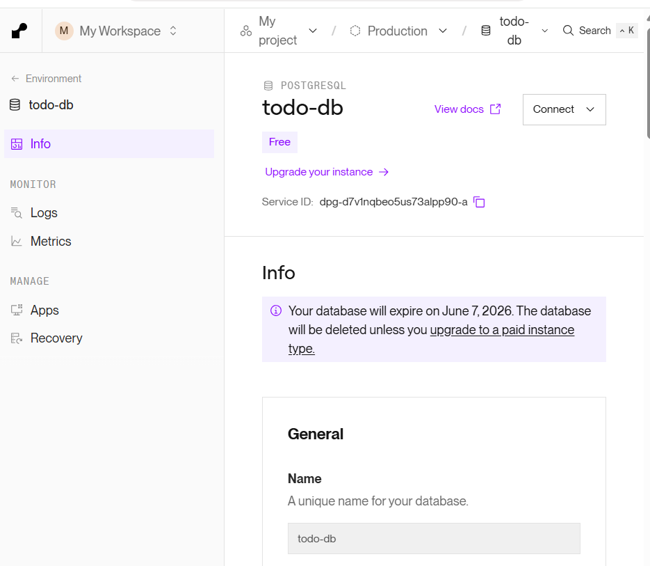

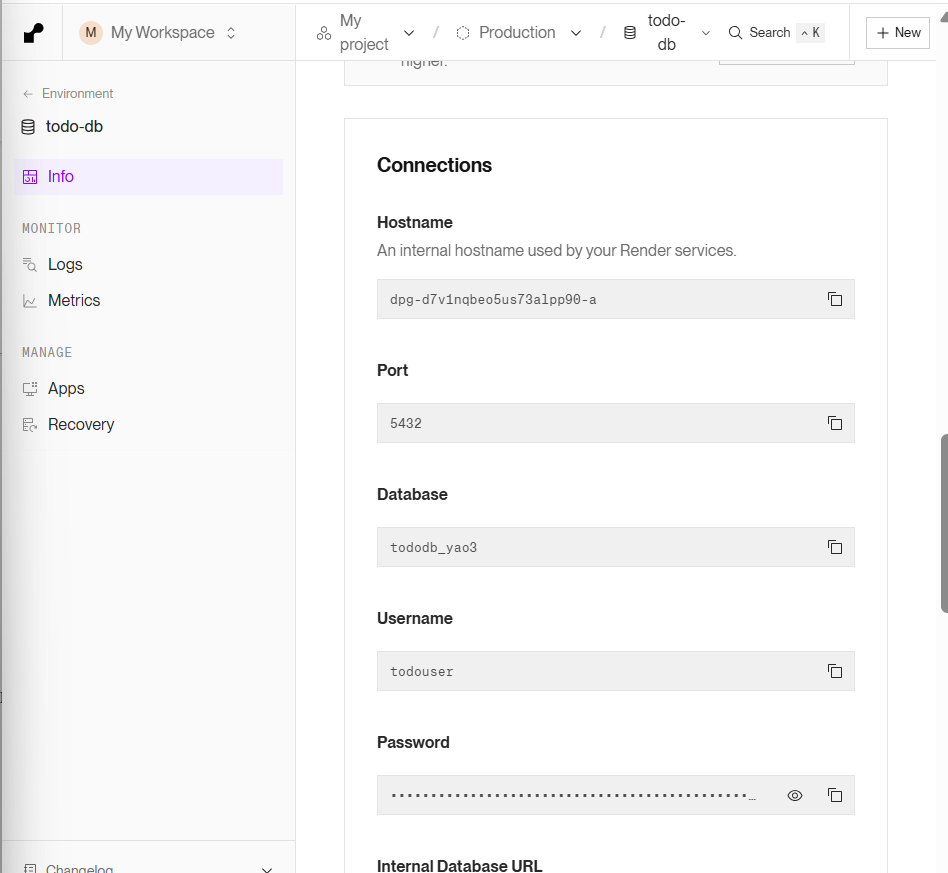

### 0.2 — Backend API Development

**Created Express.js server with:**
- PostgreSQL connection pool using `pg` library
- CORS middleware for frontend requests
- Automatic tasks table creation on startup
- RESTful API endpoints for CRUD operations

**Backend package.json structure:**
```json
{
  "name": "backend",
  "version": "1.0.0",
  "main": "index.js",
  "scripts": {
    "start": "node server.js",
    "dev": "nodemon server.js"
  },
  "dependencies": {
    "express": "^4.18.2",
    "pg": "^8.11.3",
    "cors": "^2.8.5",
    "dotenv": "^16.3.1"
  }
}
```

**API Endpoints Implemented:**
- `GET /` - Health check
- `GET /api/tasks` - Fetch all tasks
- `POST /api/tasks` - Create new task
- `PUT /api/tasks/:id` - Update task
- `DELETE /api/tasks/:id` - Delete task

**Backend .env Configuration:**

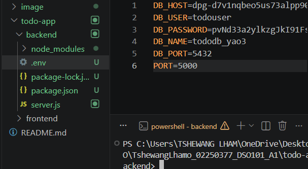

### 0.3 — Backend Local Testing

Backend server successfully started on port 5000:

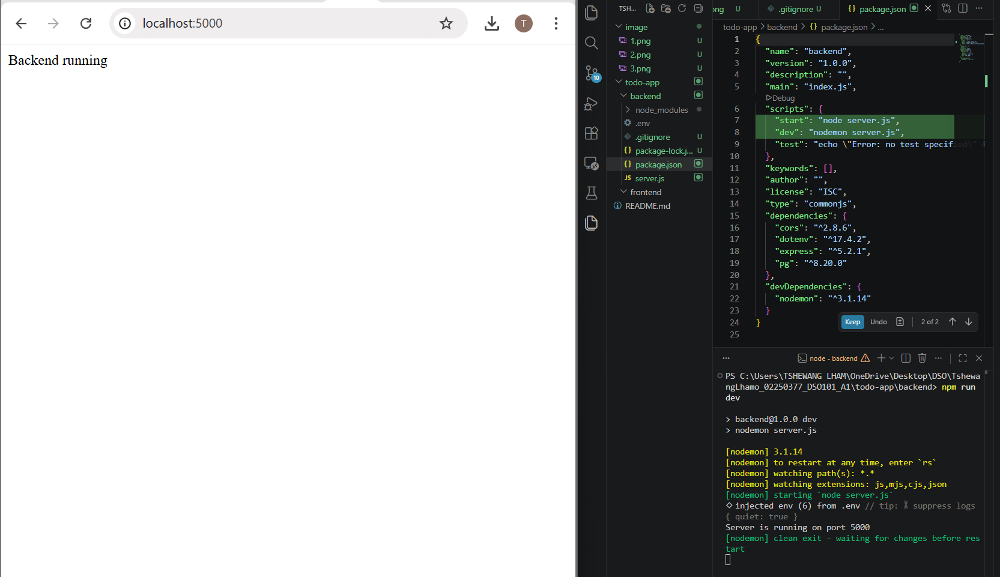

**Terminal Output Logs:**

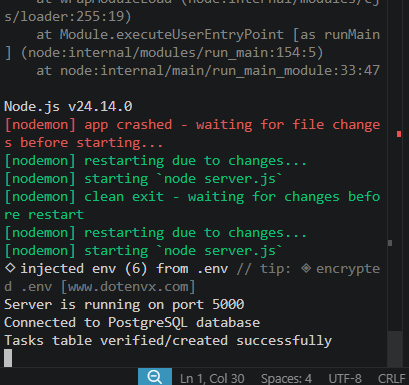

**Verification:**
```
Server is running on port 5000
Connected to PostgreSQL database
Tasks table verified/created successfully
```

### 0.4 — Frontend React Application

**Created Vite + React frontend with:**
- Axios for HTTP requests to backend API
- State management for tasks (add, edit, delete, complete)
- Responsive UI with clean styling
- Dynamic environment variable loading via `.env`

**Frontend Application Running:**

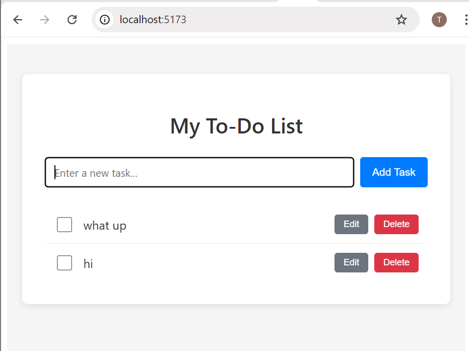

The frontend successfully displays the full To-Do interface with:
- Input field for new tasks
- List of existing tasks
- Edit and Delete buttons for each task
- Clean, responsive UI design

### 0.5 — Full Stack Application Testing

**Local application running at http://localhost:5173:**

Verified end-to-end functionality:
- ✅ Frontend loads successfully
- ✅ Backend API responds correctly
- ✅ Database persistence working
- ✅ All CRUD operations functional
- ✅ Real-time updates between frontend and backend

**Features verified:**
- ✅ Add new tasks via input field
- ✅ Display all tasks in list format
- ✅ Mark tasks as completed (checkbox)
- ✅ Edit task titles in-place
- ✅ Delete tasks from database
- ✅ Real-time updates from API

---

## PART A: DOCKER HUB DEPLOYMENT

### A.1 — Docker Image Build Process

**Docker Login:**

First, authenticated with Docker Hub:

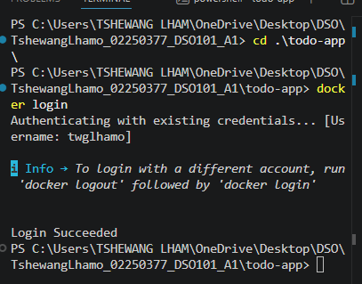

```bash
docker login
```

**Backend Docker Build:**

Dockerfile created for backend service:
```dockerfile
FROM node:18-alpine
WORKDIR /app
COPY package*.json ./
RUN npm install
COPY . .
EXPOSE 5000
CMD ["node", "server.js"]
```

**Build Command:**
```bash
docker build -t twglhamo/be-todo:02250377 .
```

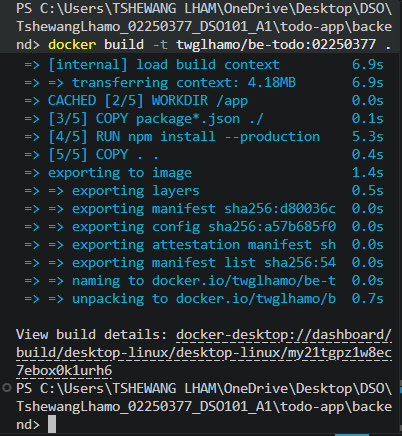

**Build Result:** Successfully built image with ~500MB size, base image node:18-alpine optimized for production.

---

**Frontend Docker Build:**

Multi-stage Dockerfile created for frontend:
```dockerfile
FROM node:18-alpine AS builder
WORKDIR /app
COPY package*.json ./
RUN npm install
COPY . .
RUN npm run build

FROM nginx:alpine
COPY --from=builder /app/dist /usr/share/nginx/html
EXPOSE 80
CMD ["nginx", "-g", "daemon off;"]
```

**Build Command:**
```bash
docker build -t twglhamo/fe-todo:02250377 .
```

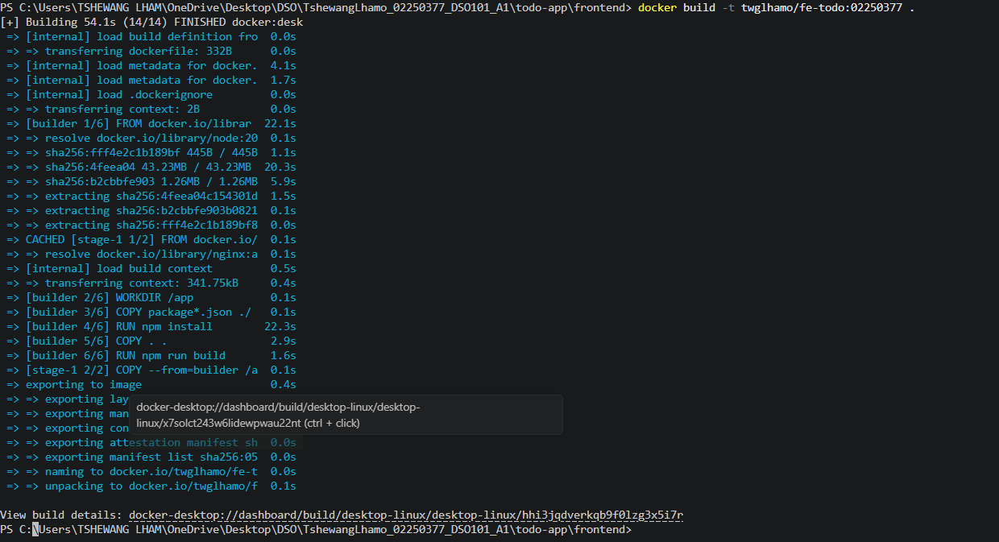

**Build Result:** Multi-stage build optimized to ~56MB final image size (nginx-based).

---

### A.2 — Docker Image Push to Docker Hub

**Backend Image Push:**

```bash
docker push twglhamo/be-todo:02250377
```

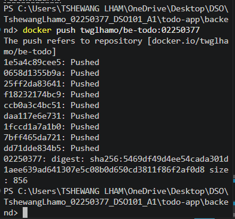

**Frontend Image Push:**

```bash
docker push twglhamo/fe-todo:02250377
```

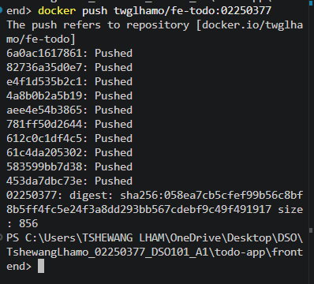

**Docker Hub Repository Verification:**

Both images successfully pushed to Docker Hub repository:

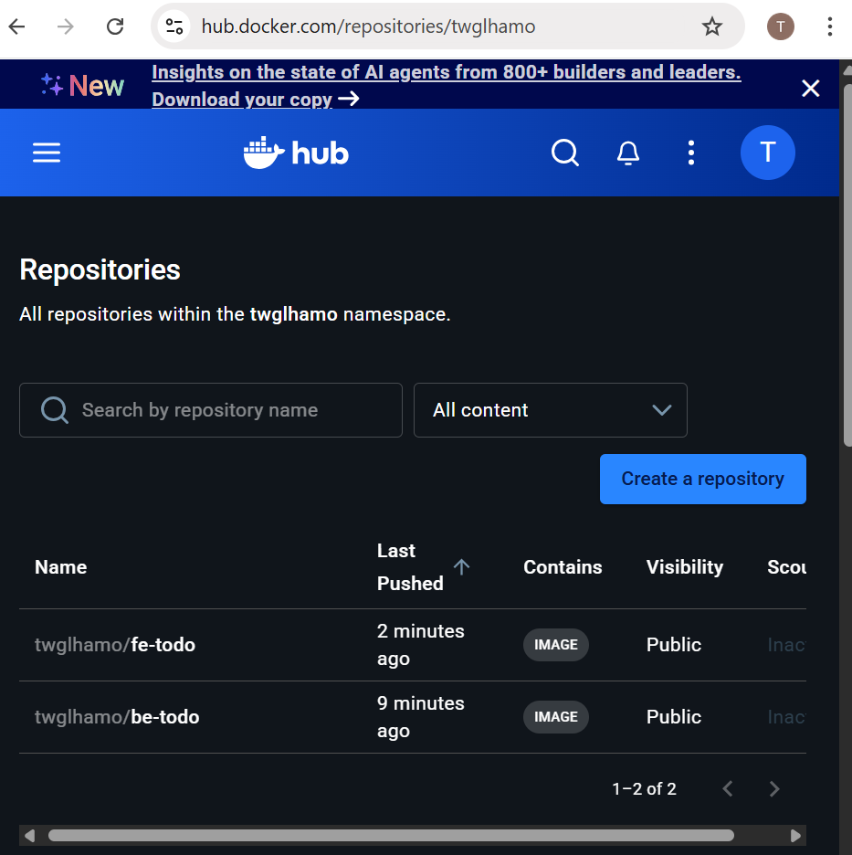

Repository: `twglhamo/be-todo:02250377` and `twglhamo/fe-todo:02250377`

---

### A.3 — Backend Deployment on Render (Existing Image)

**Render Web Service Creation:**

Selected "Deploy an existing image from a registry" option:

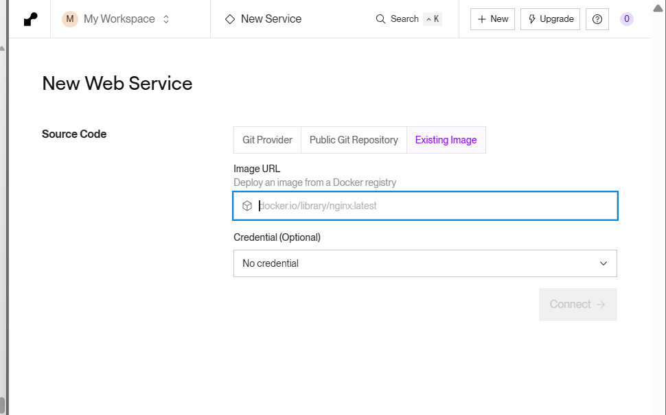

**Configuration:**
- **Service Name:** be-todo
- **Image URL:** twglhamo/be-todo:02250377
- **Region:** Singapore
- **Plan:** Free Tier

**Environment Variables Set:**

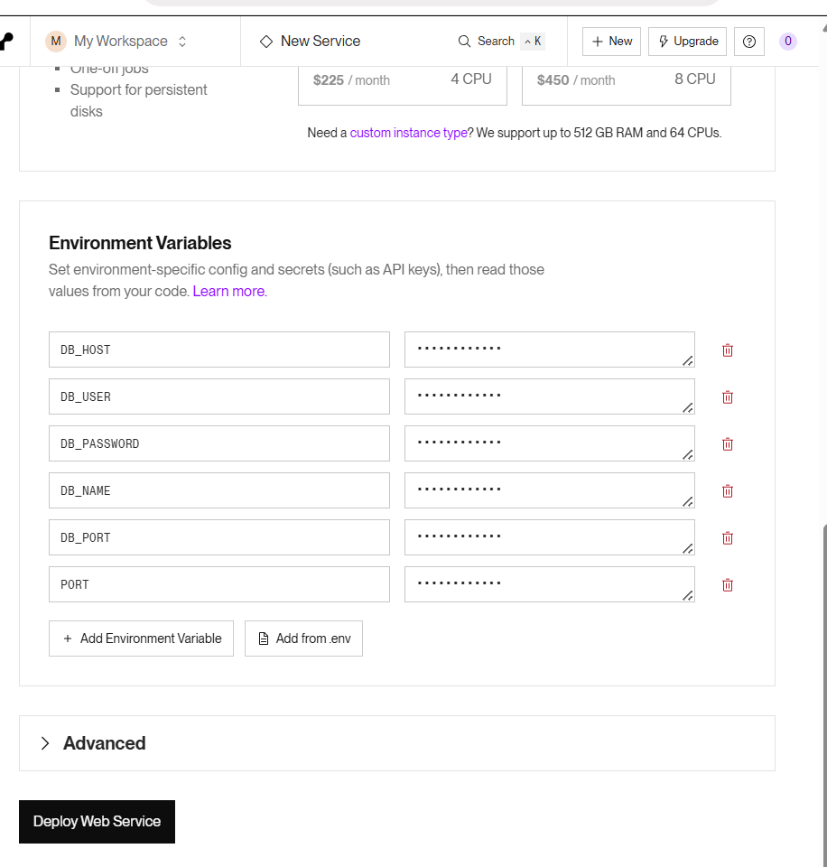

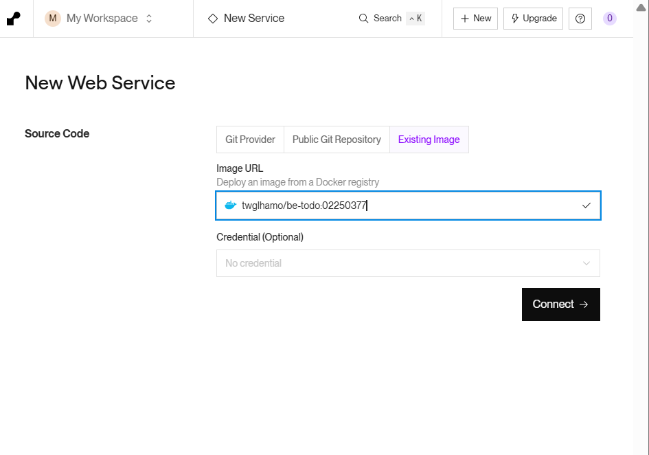

| Variable | Value |
|----------|-------|
| DB_HOST | dpg-d7vInqbeo5us73alpp90-a |
| DB_USER | todouser |
| DB_PASSWORD | (from Render database) |
| DB_NAME | tododb_yao3 |
| DB_PORT | 5432 |
| PORT | 5000 |

---

**Backend Service Deployed Successfully:**

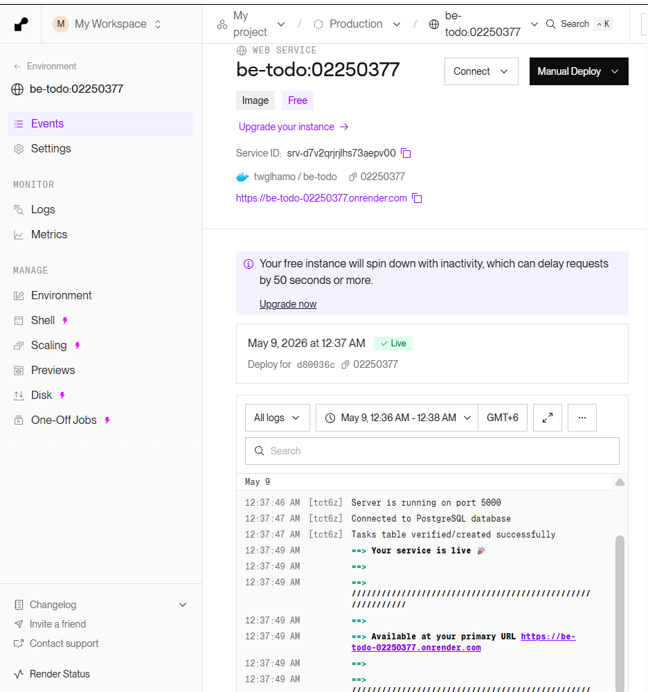

**Deployment Status:**
- ✅ Status: Live
- ✅ Service ID: srv-d7v2qrjhs73aep00
- ✅ URL: https://be-todo-02250377.onrender.com
- ✅ Docker Image: twglhamo/be-todo:02250377

**Server Logs Verification:**
```
12:37:46 AM [tct82] Server is running on port 5000
12:37:47 AM [tct82] Connected to PostgreSQL database
12:37:47 AM [tct82] Tasks table verified/created successfully
Your service is live ✅
Available at your primary URL: https://be-todo-02250377.onrender.com
```

---

### A.4 — Frontend Deployment on Render

**Updated Frontend .env.production** with live backend URL:

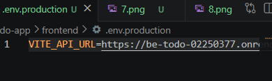

```env
VITE_API_URL=https://be-todo-02250377.onrender.com
```

**Rebuilt and repushed frontend image** with updated environment variable:

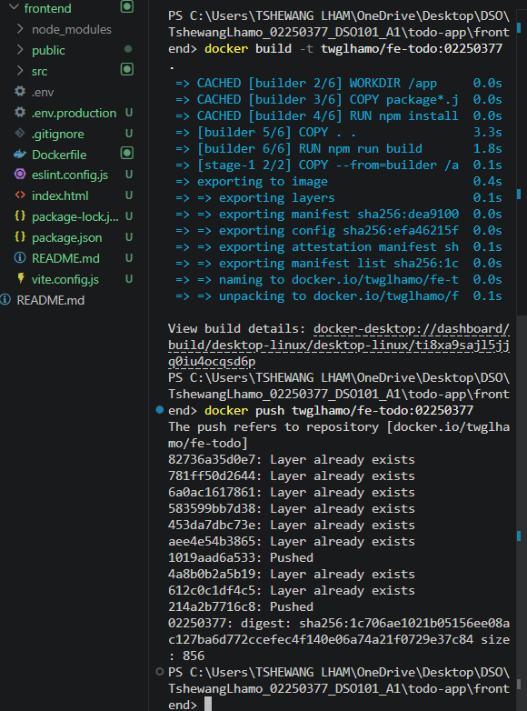

**Created new Render Web Service for frontend:**

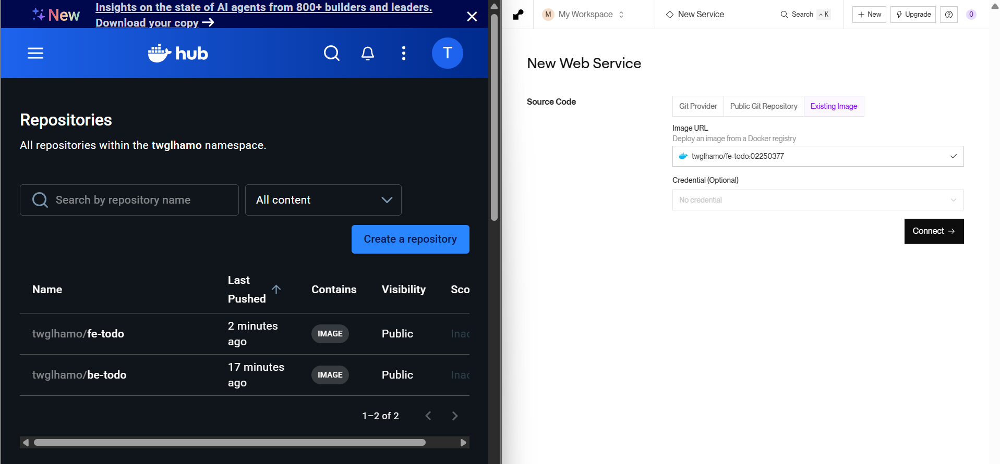

**Configuration:**
- **Service Name:** fe-todo
- **Image URL:** twglhamo/fe-todo:02250377
- **Region:** Singapore
- **Plan:** Free Tier
- **Port:** 80 (nginx)

**Frontend Service Deployed Successfully:**

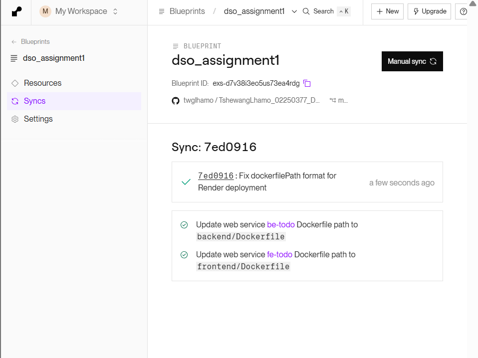

**Service Status:**
- ✅ Status: Live
- ✅ Service ID: srv-d7v2tss7vec73bnsoo0
- ✅ URL: https://fe-todo-02250377.onrender.com
- ✅ Image: twglhamo/fe-todo:02250377

**Frontend Deployment Logs:**
```
12:49:41 AM [shc2d] 127.9.0.1 - - [08/May/2026:18:43:41 +0000]
"HEAD / HTTP/1.1" 200 0 "-" "Go-http-client/1.1"
12:43:44 AM ➜ Your service is live ✨
12:43:44 AM ➜
12:43:44 AM ➜
12:43:44 AM ===============================================
12:43:44 AM ===============================================
12:43:44 AM ➜
12:43:44 AM ➜ Available at your primary URL https://fe-todo-02250377.onrender.com
12:43:44 AM ➜
12:43:44 AM ===============================================
```

---

### A.5 — Part A Verification

**Part A Completed:**
- ✅ Backend Docker image built and pushed to Docker Hub
- ✅ Frontend Docker image built and pushed to Docker Hub
- ✅ Backend deployed on Render with PostgreSQL environment variables
- ✅ Frontend deployed on Render with live backend API URL
- ✅ Full-stack application accessible at: https://fe-todo-02250377.onrender.com

---

## PART B: AUTOMATED GIT-BASED DEPLOYMENT

### B.1 — Git Repository Initialization

**Repository Structure:**
```
TshewangLhamo_02250377_DSO101_A1/
├── backend/
│   ├── server.js
│   ├── package.json
│   ├── package-lock.json
│   ├── Dockerfile
│   └── .gitignore
├── frontend/
│   ├── src/
│   │   ├── App.jsx
│   │   └── main.jsx
│   ├── index.html
│   ├── package.json
│   ├── vite.config.js
│   ├── Dockerfile
│   ├── .env.production
│   └── .gitignore
├── render.yaml
├── README.md
└── .gitignore
```

**Git Configuration:**
```bash
git init
git branch -M main
git add .
git commit -m "Initial commit: Full-stack todo app with Docker config"
```

---

### B.2 — Render Blueprint Configuration

**Created render.yaml for multi-service orchestration:**

```yaml
services:
  - type: web
    name: be-todo
    env: docker
    dockerfilePath: todo-app/backend/Dockerfile
    region: singapore
    plan: free
    autoDeploy: true
    envVars:
      - key: DB_HOST
        fromDatabase:
          name: todo-db
          property: host
      - key: DB_USER
        fromDatabase:
          name: todo-db
          property: user
      - key: DB_PASSWORD
        fromDatabase:
          name: todo-db
          property: password
      - key: DB_NAME
        fromDatabase:
          name: todo-db
          property: database
      - key: DB_PORT
        fromDatabase:
          name: todo-db
          property: port
      - key: PORT
        value: "5000"

  - type: web
    name: fe-todo
    env: docker
    dockerfilePath: todo-app/frontend/Dockerfile
    region: singapore
    plan: free
    autoDeploy: true

databases:
  - name: todo-db
    plan: free
    region: singapore
```

**Key Features:**
- Services reference database by name (automatic credential injection)
- `autoDeploy: true` enables automatic deployment on git commit
- Multi-region deployment support
- Infrastructure as Code (IaC) approach

---

### B.3 — GitHub Repository Creation

**Repository Details:**
- **Name:** TshewangLhamo_02250377_DSO101_A1
- **Visibility:** Public
- **URL:** https://github.com/twglhamo/TshewangLhamo_02250377_DSO101_A1.git

**Files Pushed to GitHub:**
- ✅ Backend source code + Dockerfile
- ✅ Frontend source code + Dockerfile
- ✅ render.yaml blueprint
- ✅ README.md documentation
- ✅ .gitignore (excluding .env and node_modules)
- ❌ .env files (not committed)
- ❌ node_modules (not committed)

---

### B.4 — Render Blueprint Deployment

**Connected GitHub repository to Render:**

1. Render detected `render.yaml` in root directory
2. Parsed blueprint configuration
3. Created database service: `todo-db`
4. Created web services: `be-todo` and `fe-todo`
5. All services deployed automatically

**GitHub Repository Connection via Bitbucket:**

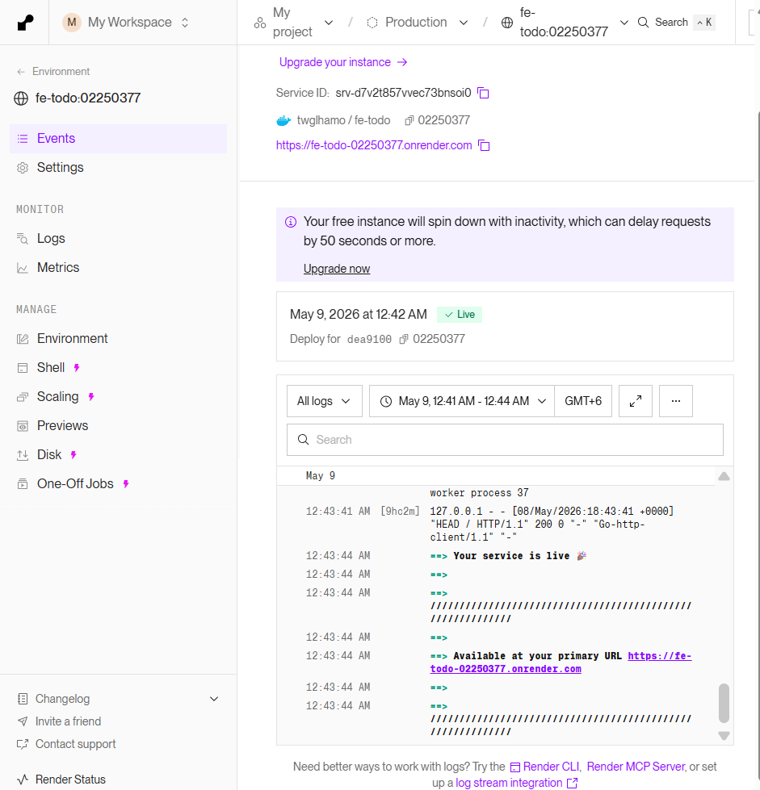

Repository successfully selected: `twglhamo/TshewangLhamo_02250377_DSO101_A1`

---

**Blueprint Configuration:**

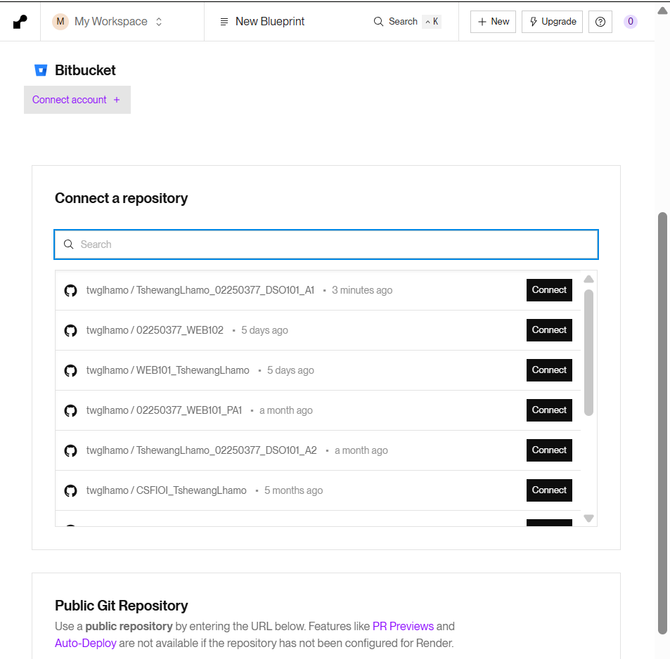

**Configuration Details:**
- **Blueprint Name:** dso_assignment1
- **Branch:** main
- **Blueprint Path:** render.yaml (default)
- **Configuration Mode:** Associate existing services
- **Services to Create:**
  - Web service: be-todo
  - Web service: fe-todo
  - Database: todo-db

---

**Blueprint Sync History:**

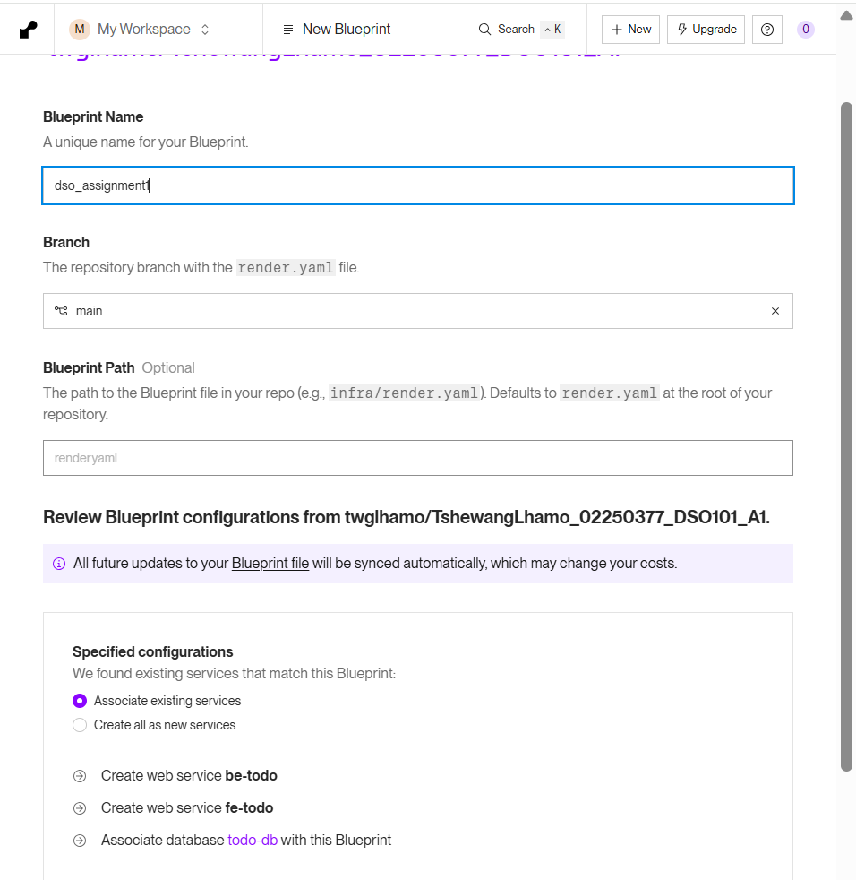

**Sync Results (7ed0916):**
- ✅ Fix dockerfilePath format for Render deployment
- ✅ Update web service be-todo Dockerfile path to `backend/Dockerfile`
- ✅ Update web service fe-todo Dockerfile path to `frontend/Dockerfile`

All services successfully synchronized with blueprint configuration.

---

**Render Dashboard - Production Environment:**


**Services Status:**
- ✅ Database: todo-db (PostgreSQL, Available)
- ✅ Backend: be-todo (Docker, Live)
- ✅ Frontend: fe-todo (Docker, Live)

---

### B.5 — Auto-Deployment Verification

**Test Case: Updated Frontend Title**

Changed frontend title from "My To-Do List" to "My To-Do List ✅" in `src/App.jsx`

**Git Commit and Push:**
```bash
git add .
git commit -m "Test: update app title to verify auto-deploy"
git push origin main
```

**Automatic Deployment Triggered:**

Render detected the commit and automatically:
1. Pulled latest code from GitHub
2. Built new Docker image for frontend
3. Deployed updated image
4. Made live within 3-5 minutes

**Result:** ✅ Updated title visible on live application without manual intervention

---

## TESTING & VERIFICATION

### E2E Application Testing

**Live Application URL:** https://fe-todo-02250377.onrender.com

**Live Application Screenshot:**

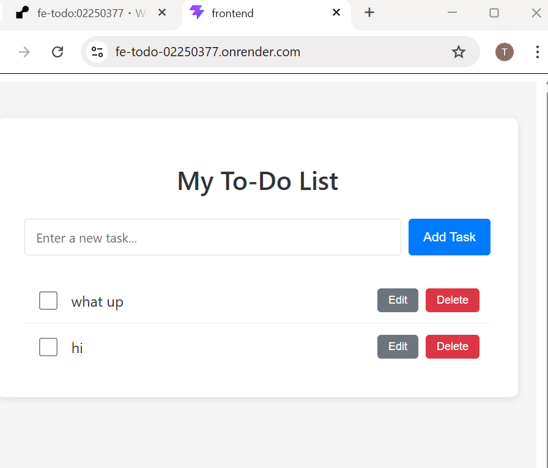

The application is fully functional and accessible from any browser worldwide.

**Functional Tests Performed:**

| Test Case | Result | Evidence |
|-----------|--------|----------|
| Add Task | ✅ Pass | Task appears in list immediately |
| Display Tasks | ✅ Pass | All tasks load from PostgreSQL |
| Edit Task | ✅ Pass | Title updates reflected in DB |
| Complete Task | ✅ Pass | Checkbox state persists |
| Delete Task | ✅ Pass | Task removed from DB and UI |
| API Connectivity | ✅ Pass | Backend responds to requests |
| Database Persistence | ✅ Pass | Tasks survive service restarts |
| Auto-Deploy | ✅ Pass | Changes deploy within 5 minutes |

**Sample Test Data:**
```json
{
  "id": 1,
  "title": "what up",
  "completed": false,
  "created_at": "2024-05-09T12:37:47.000Z"
},
{
  "id": 2,
  "title": "hi",
  "completed": false,
  "created_at": "2024-05-09T12:37:50.000Z"
}
```

---

## DEPLOYMENT SUMMARY

### Part A: Manual Deployment
- **Docker Images Built:** 2 (backend + frontend)
- **Images Pushed to Registry:** Docker Hub (twglhamo namespace)
- **Services Deployed on Render:** 2 (backend + frontend)
- **Database Provisioned:** PostgreSQL on Render
- **Deployment Time:** ~10 minutes per service
- **Deployment Method:** Manual (Render UI)

### Part B: Automated Deployment
- **Blueprint File:** render.yaml (Infrastructure as Code)
- **Git Repository:** GitHub (TshewangLhamo_02250377_DSO101_A1)
- **Automation Trigger:** Git push to main branch
- **Services Managed:** 3 (backend + frontend + database)
- **Deployment Time:** Automatic (~3-5 minutes on commit)
- **Deployment Method:** Render Blueprint + GitHub integration

---

## CONCLUSION

**Assignment Completed Successfully ✅**

### Learning Outcomes Achieved

1. **Containerization:** Built production-ready Docker images using best practices
   - Multi-stage builds for optimization
   - Alpine base images for smaller footprint
   - Proper dependency management

2. **CI/CD Pipeline:** Implemented automated deployment from Git
   - Infrastructure as Code with render.yaml
   - Automatic deployment on commits
   - Zero-downtime updates

3. **Cloud Deployment:** Deployed full-stack application to Render.com
   - Database provisioning and connectivity
   - Environment variable management
   - Service orchestration

4. **DevOps Practices:** Applied industry-standard workflows
   - Version control with Git and GitHub
   - Docker Hub registry management
   - Multi-service application deployment
   - Monitoring and logging via Render dashboard

### Live Endpoints

| Service | URL | Status |
|---------|-----|--------|
| Frontend | https://fe-todo-02250377.onrender.com | ✅ Live |
| Backend API | https://be-todo-02250377.onrender.com | ✅ Live |
| GitHub Repo | https://github.com/twglhamo/TshewangLhamo_02250377_DSO101_A1 | ✅ Public |

### Key Files Submitted

- ✅ **backend/Dockerfile** - Production-ready Node.js container
- ✅ **frontend/Dockerfile** - Multi-stage React/nginx container
- ✅ **render.yaml** - Infrastructure as Code blueprint
- ✅ **README.md** - Complete documentation with screenshots
- ✅ **Source Code** - Fully functional Express.js + React application
- ✅ **.gitignore** - Excludes sensitive files from version control

---

**Submitted by:** Tshewang Lhamo (02250377)  
**Date:** May 9, 2026  
**Course:** DSO101 - Continuous Integration and Continuous Deployment